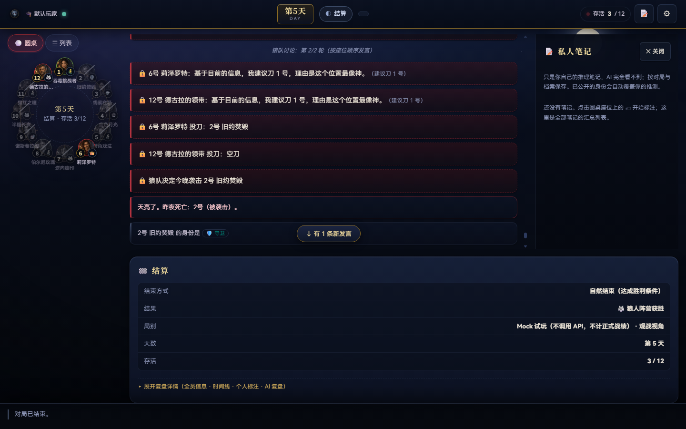
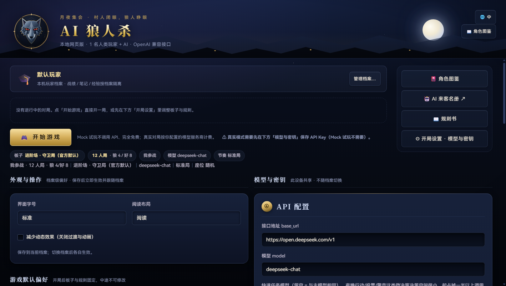

# 双端收尾工程验收报告与第一轮返修单

日期：2026-09-20

审核源码：`cfd01d7`，相对施工基线 `74ca56a`。

依据：[最终施工计划书](final-delivery-construction-plan.md)。本报告不替代原计划，仅记录本次实测结果、未完成范围与返修要求。

## 1. 验收结论

**不通过正式验收。保留现有成果，先由原施工方按本清单返修；复验仍不合格的项目，再由审核方接手。**

本次不是只剩美化：已复现并发笔记丢失、手机笔记页不可见、重启后手机恢复入口消失、档案归属显示错误和制品滞后。不能据自动化全绿宣称“全部完成”。

当前质量判断：有真实进展，品牌母版、数据层和基础界面均有落地；短板集中在跨层集成、完整用户路径、异常恢复和测试断言。该判断依据下面的代码与复现结果，不依据开发模型的名称。

### 本次执行范围

- 本机 Windows、现有 Node/Chrome 环境；独立 `WW_DATA_DIR`、端口 3641；只创建验收档案和 Mock 对局，未读取正式密钥或调用付费模型。
- 重跑 `npm test`、`npm run gate`、`npm run ui:check -- --full --strict`、`npm run app:verify`。
- 实际浏览器操作：桌面 1440×900；手机 390×844、320×568；开局、选人、笔记、切档、刷新、服务重启恢复。
- 独立 HTTP 故障／时序复现脚本：[reproduce.cjs](../output/review-2026-09-20/reproduce.cjs)。只操作独立临时样本，不修改业务代码。
- **本轮未重新执行 Android 物理真机、全部 Windows DPI、完整 72 项矩阵或长局性能测量。未执行不记通过。** 施工方模拟器证据不是本轮物理真机证据。

### 重跑结果

| 检查 | 本次结果 | 能证明什么／不能证明什么 |
| --- | --- | --- |
| `npm test` | 601/601；0 fail、0 skipped | 当前用例通过，不代表未覆盖的交互通过 |
| `npm run gate` | EXIT 0 | lint 152 文件、ESLint、coverage、固定种子 eval、品牌 62 项、版本检查通过 |
| 覆盖率 | 全局行 94.41 / 分支 85.68 / 函数 88.11；api.js 行 92.36 / 分支 78.65 | 门槛保持，不下调 |
| `ui:check --full --strict` | EXIT 0 | 现有浏览器脚本场景通过；没有覆盖本报告多项真实失败路径 |
| `app:verify` | **EXIT 1** | APK 与 Windows 目录包各有 5 个文件落后于源码 |
| 独立并发 HTTP 复现 | **失败情形确认** | 两个同 revision 操作均 200，已保存的新笔记丢失 |
| 手机真实点击“笔记” | **失败** | 页签选中，但笔记面板仍 `display:none` |

原来的 HTML 表示 ETag 修复和“恢复记录写失败不能虚报回滚”实现有实际改进，对应现有回归本轮通过；无需推倒重做。但导入信息到 HTTP／界面的传递仍有 AC-08 的缺口。

## 2. 返修总表

P1 表示本轮发布阻断；P2 表示正式质量交付前必须补齐的功能／体验缺陷。不能把 P2 自动划进原计划的 NEXT 后续功能。

| 编号 | 级别 | 问题 | 原工作包 |
| --- | --- | --- | --- |
| AC-01 | P1 | 笔记 PUT 与 DELETE 不共锁，并发成功后丢数据 | FIN-07 / FIN-12 |
| AC-02 | P1 | 手机笔记页签不显示笔记面板 | FIN-06 / FIN-07 |
| AC-03 | P1 | 服务重启后手机删除可恢复对局句柄 | FIN-06 / FIN-10 |
| AC-04 | P1 | 档案 B 名下显示／恢复档案 A 的对局及笔记 | FIN-04 / FIN-07 |
| AC-05 | P1 | 安装包未包含最后一轮 UI 修复；Electron 内容验证不完整 | FIN-09 / FIN-13 |
| AC-06 | P2 | 桌面笔记无未保存保护，模态焦点仍能操作背景 | FIN-03 / FIN-07 |
| AC-07 | P2 | 自称身份错误复用候选池，无法记录对跳 | FIN-07 |
| AC-08 | P2 | 待清理恢复信息被真实 HTTP 路由丢掉，界面入口未落地 | FIN-02 / FIN-04 |
| AC-09 | P2 | 手机 8 秒看门狗早于服务端 16 秒心跳，误判断线 | FIN-10 |
| AC-10 | P2 | 主操作触区规则被覆盖；默认圆桌仍拥挤难读 | FIN-03 / FIN-05 |
| AC-11 | P2 | 首页／开局／历史对局信息架构仍只做了部分 | FIN-04 |
| AC-12 | P1 | 设备脚本可假通过，未验证可见交互和失败退出 | FIN-12 |

## 3. 逐项复现、修复边界与通过标准

### AC-01：并发笔记写入丢失

位置：[src/api.js](../src/api.js) 1856–1880 行；[src/annotations/store.js](../src/annotations/store.js) 115–162 行。

`gameAnnotationsPut()` 调用不入队列的 `putSync()`；DELETE 调用异步入队的 `clearSeat()`。为异步 `put()` 与 `clearSeat()` 配同一队列，不能保护实际路由里的同步 PUT。

复现：已有 revision=1 的座位 2 笔记；DELETE 座位 2 在读完后等待临时文件写入；另一请求用 revision=1 PUT 座位 3；随后放行 DELETE。使用真实 HTTP，仅在隔离进程中延长一次文件写入等待，模拟正常异步 I/O 的竞争窗口。

```text
DELETE status=200, revision=2
PUT    status=200, revision=2
最终 revision=2, seats={}
PUT 返回成功的座位 3 笔记消失
```

返修：同一笔记文件的所有可并发修改必须走同一串行原语，包括 PUT、DELETE 与有关内部入口；读、校验、合并、写入都在该事务内。不得用删除回归、忽略 revision 或前端禁用按钮掩盖服务端竞态。

验收：真实 HTTP 的 PUT/PUT、PUT/DELETE、DELETE/DELETE 同 revision 竞争只允许一个成功，另一个 409；成功方内容及其他座位均保留。连续三轮，并另测写失败后队列可继续工作、tmp 不污染后续事务。

### AC-02：手机笔记页实际不可见

位置：[web/m/m.js](../web/m/m.js) 1367–1380 行；[web/m/index.html](../web/m/index.html) 187 行。

复现：进入手机 Mock 局，点击“🏷 笔记”。`#m-game` 变成 `tab-notes`，但 `#m-notes-pane` 仍为 `m-pane hidden`、高度 0、`display:none`；`#m-board` 仍然显示旧的两侧座位＋发言布局。笔记列表内容虽在 DOM 中生成，用户看不到、点不到，撤销入口也因此不可用。

返修：页签选择、面板显隐、可访问状态统一管理；notes 时显示笔记面板、隐藏 board，返回 speech/players 时反向恢复。不要仅给 class 加测试或强制点击隐藏元素。

验收：390/320px 真点击三个页签，逐一断言选中态、面板有非零尺寸、背景面板不可交互；从可见列表打开编辑、保存、撤销、刷新恢复。切页保留目标和历史滚动位置。

### AC-03：服务重启后手机把可恢复局当成无对局

位置：[web/m/m.js](../web/m/m.js) 1295–1313 行。

复现：手机创建 Mock 局，刷新仍有“继续上局”；仅重启隔离服务，保留同一个数据目录，再刷新手机。后端 `/api/games` 仍返回该局 `finished:false, inMemory:false, resumable:true`，手机却隐藏恢复卡，并执行 `localStorage.removeItem('mww_current')`。点击底部“对局”提示“没有进行中的对局——先开始一局吧”。

原因：`loadResumeCard()` 将 `!inMemory` 与“已结束／从未开局”合并处理。磁盘局可恢复，不等于仍驻留内存。

返修：区分运行中、暂停、仅在磁盘可恢复、已结束、确实不存在、网络失败；可恢复局调用既有 resume 流程。网络失败和暂不在内存均不得删除句柄；“对局”入口应能按档案找回磁盘存档，而非仅依赖一个 localStorage key。

验收：服务重启、Android 应用进程重启、暂停局、短暂离线均能保留正确入口；恢复后 owner、笔记、事件和待办一致；确认终局才清除运行句柄。重启用隔离数据，不要求用户卸载清数据。

### AC-04：切档后恢复与顶部归属不一致

位置：[web/app.js](../web/app.js) 939–972、3761–3772 行；[web/m/m.js](../web/m/m.js) 1083 行附近及恢复卡逻辑。

本次复现：桌面以“默认玩家”开局并保存“档案 A 的私人笔记”；同 origin 手机页创建并选用“验收档案 B”；刷新桌面。桌面直接进入 A 的旧局，顶部却标为“🎓 验收档案 B”，title 仍声称“当前玩家档案（本局归属）”，右栏展示 A 的笔记。

这是归属与操作上下文错误，不应夸大为密码系统越权：本产品本来没有密码隔离。但它会让用户误认为自己在写 B 的数据，违反本机档案的基本产品契约。

返修：当前浏览档案和当前对局 owner 分开；恢复前校验归属，提示切回对应档案或取消；顶栏取实际 owner 快照。恢复索引按档案组织，多窗口迟到响应用上下文／generation 丢弃，不只修顶部文案。

验收：A/B 两档案、两个窗口、双端同 origin、刷新和服务重启组合；B 默认不进入 A 的局；明确选择恢复 A 时，顶栏、存盘、笔记、经验归属都为 A。客户端选择不能重写旧局 owner。

### AC-05：制品滞后和包验证盲区

本次 `npm run app:verify` 明确失败。APK 与 Windows 目录包都在以下 5 项不一致：

```text
web/app.js
web/i18n.js
web/index.html
web/m/m.css
web/style.css
```

它们正是最后一轮 UI 修复涉及的运行文件。源码截图不能证明用户安装的是同一版本。

另：[scripts/verify-packages.js](../scripts/verify-packages.js) 364–369 行的 `verifyDesktop()` 只检查 portable EXE 图标／版本，返回 `checked:0`；不能用该项通过宣称 Electron 内嵌服务和 Web 文件与源码一致。清单所记 portable 哈希以 `ef90e5a8…` 开头，本轮实际验证的文件为 `cee7345e…`，清单亦不对应现物。

返修：全部修复后冻结 commit，重建实际交付的三种包；验证目录包对应 ZIP、Electron payload／asar 中的运行文件，而不只看外壳图标；重新生成清单与 SHA-256。必交包缺失时发布模式必须失败，当前“全部没有也 exit 0”不可作为发布门禁。

验收：基于同一最终 commit 的 APK、Windows ZIP／目录、portable 内容核对全部通过；故意改一个运行文件或撤走一个必交包，门禁应非零。最后一轮代码再变化，包与报告都要重做。

### AC-06：桌面笔记草稿和模态焦点

位置：[web/app.js](../web/app.js) 3379–3427 行及笔记编辑器。

复现一：打开座位 2 笔记、输入文字、不保存、按 Esc。没有放弃确认，重新打开后输入为空。

复现二：点“2号私人笔记”打开面板，焦点仍停在背景按钮；按 Tab 后焦点落到背景“3号”座位。弹窗没有设初始焦点，只有弹窗内部的 Tab handler 无法拦住尚在外部的焦点。

返修：通用模态统一初始焦点、背景 inert／等价防交互、正确 dialog 语义与焦点还原；笔记所有关闭途径走 dirty 守卫，包括 Esc、遮罩、关闭键和被另一个弹层替换。保存失败保留草稿和可重试撤销快照。

验收：键盘只能到达最上层弹窗；不能在写笔记时触发背景游戏动作；未保存关闭可“继续编辑／明确放弃”；取消后文字完整。不要通过禁止 Esc 或去掉关闭入口解决。

### AC-07：无法记录别人自称自己的唯一身份

位置：[web/app.js](../web/app.js) 1581–1590 行；[web/m/m.js](../web/m/m.js) 2307–2317 行。

复现：本局本人是女巫，打开他人的笔记，“自称身份”下拉没有女巫。两端均把 `possibleRolesFor()` 的结果同时用于候选和自称，扣除本人唯一身份后也删掉了可记录的对跳身份。

返修：分离“我认为可能是什么”和“TA 说自己是什么”。自称至少允许本板子的全部角色，不按本人角色和已公开人数过滤；历史自称仍可展示，不能因翻牌悄悄消失。

验收：本人预言家／女巫时能记录他人同角色自称；保存、刷新、导出往返保留；不影响推测候选上限和游戏真实身份。

### AC-08：恢复记录警告在 HTTP 层被吞，管理入口缺失

位置：[src/api.js](../src/api.js) 736–737、1673 行；双端“设备与数据”界面。

复现：隔离保存目录放入损坏的 `.import-recovery-*.json`，再导入合法包。直接调用 `importApplyRes()` 会返回 `pendingRecoveries:[{reason:'corrupt',…}]`；真实 HTTP 导入返回重新拼装的成功对象，字段被丢掉，损坏记录仍在。复现脚本包含此项。

返修：成功与失败响应都透传经过白名单处理的恢复状态；实现用户可见的待清理列表／重试入口。记录持久化失败时保留诊断和残留信息，不能丢失在只含 message 的通用异常里；不向公共日志泄露凭证或本机完整路径。

验收：损坏记录、删除失败、记录写失败分别走真实 HTTP→可见 UI；用户能知道还有什么未清理。仅修内部函数单测不算完成；只重试清理不应额外创建一个导入档案。

### AC-09：手机正常空闲会被误判为推送故障

位置：[src/api.js](../src/api.js) 29–30 行；[web/m/m.js](../web/m/m.js) 1398–1430 行。

服务端心跳为 `500ms × 32 = 16s`；手机看门狗 `>8000ms` 就关闭 EventSource，4 秒检查一次。等待玩家输入时，下一次正常心跳尚未到达就会在约 8–12 秒降级。手机实测已出现“推送无响应，已切换为轮询”，当时服务持续正常。

返修：共享或明确约定心跳／超时参数，考虑后台节流；参考桌面已处理的策略但保持手机生命周期语义；降级后有受控重试，状态提示单例，不无限堆消息。

验收：正常停在玩家待办至少 60 秒不误降级；真断流能在约定时间提示；恢复网络后回到推送；没有重复连接、重复事件和重复游戏行动。

### AC-10：实际尺寸与阅读质量未达标

位置：[web/m/m.css](../web/m/m.css) 805–806 行；[web/style.css](../web/style.css) 718、846、859–861 行。

- 手机预言家“查验”按钮可用态实测 `306×44px`。52px 的 `[data-confirm]` 与后面的 `.key` 规则同优先级，后者覆盖为 44px；原计划要求主操作≥52px。
- 桌面默认 240px 左栏里塞 12 人圆桌，座位宽 56px、姓名 10px、标签互相挤压。存在列表模式不等于默认视图已可读；不能把“切到另一个视图才合格”当成默认交付。
- 注意：手机顶栏 36px 图标有 `::after` 外扩触区，本报告**不把视觉框 36px直接认定为触区不合格**。返修扫描要测命中区域，不能只看一个 CSS 数值。

返修：合并控件规则，测最终计算尺寸；三栏默认采用可读列表，圆桌需另有足够空间的展示模式，或在容量不足时明确降级；身份推测、存活／死亡、目标选择不能靠 10px 小字区分。

验收：真按钮启用／禁用／处理中均达标；12/13 人与长昵称下不重叠；100–200% 桌面缩放、手机 320px 下可操作。截图须为真实产品，不是设计稿。

### AC-11：信息架构仍是部分改造，不是 FIN-04 完成

位置：[web/index.html](../web/index.html) 133–154 行及设置区；[web/m/m.js](../web/m/m.js) 首页底部入口与 `renderRules()`。

本次可见事实：桌面首页下方仍是长期展开的多栏配置长表单，没有原计划的三步开局／最终确认页；无 Key 时首页“开始游戏”先报错，Mock 入口仍藏在较下方的玩家卡。手机“对局”不是按档案显示进行中／暂停／结束的列表，当前无句柄时只给一句提示。手机规则确认页也未集中复核真实／Mock、模型和费用状态。

返修：依原计划补全“首页／开局／设置／我的对局”的职责划分；不要只是增加分组标题后仍保留同一大表单。关于页补可追溯构建标识；常用设置与高级模型调参分层；无 Key 用户有清楚的一步 Mock 入口，不改安全门禁。

验收：首次打开能明确选择试玩；开局最终确认列出档案、板子、人数、座位策略、真实／Mock、模型配置状态；后退保留输入；历史列表按档案筛选并可恢复。先交真实双端页面录屏，确认结构后再追加装饰。

### AC-12：设备验收脚本不能作为可靠通过依据

位置：[scripts/device-e2e.js](../scripts/device-e2e.js) 107、139–140、149–169、181–185 行。

发现：

1. `ok()` 只打印 `✓/✖`，不累计失败；正常走到末尾总是 `process.exit(0)`。
2. “笔记页生效”仅断言 `tab-notes` class，未检查面板可见。这正好漏掉 AC-02。
3. 保存直接调用 `saveAnnotations()`，撤销通过 `element.click()` 可激活隐藏按钮，未证明真实用户能点到。
4. 键盘没有输入框时也把 `no-input-yet` 当通过，不能证明键盘遮挡已验。

返修：测试结果采用通过／失败／未执行，不允许都归绿；失败和必测未执行必须非零。关键路径使用真实可见控件和点击前置条件，至少验证布局尺寸、遮挡、焦点、输入及服务端结果。内部函数测试保留为另一层，不冒充用户端到端测试。

验收：故意隐藏笔记面板、制造一个错误结果、移除输入框，三种情况都必须失败或标未执行并阻止放行。修复后用真实操作跑保存→撤销，不能用直接函数调用替代。

## 4. 精美度专项要求：本轮先让施工方补到可验收

采用 frontend-design 的设计审查原则：保留“月夜狼冠”作为唯一主要视觉识别，界面以阅读、推理和明确动作服务玩家，不靠堆边框和发光掩盖布局缺陷。

### 第一轮必须改的视觉内容

1. 首页优先显示狼冠、当前档案、继续／新局、清楚的模式选择；删重复板子摘要，低频调参进入设置，不压首屏。
2. 电脑默认座位区域提供清楚的姓名、身份信息分层、状态与独立笔记按钮。圆桌模式不挤进 240px 小盒子。
3. 手机“真实／试玩”用明确选中状态的模式卡／单选控件；不要让红色模式开关看起来像立即扣费的主行动按钮。
4. 固定行动区只保留任务、目标和主要动作；在“玩家”页已能选人时，不重复堆叠多条“去玩家页”的说明。
5. 标注面板先修真实可见、交互与自称语义，再统一间距、选中态、错误态和关闭保护。
6. 统一标题／正文／次级文字，禁止把重要名字与标记压成 10px 来满足布局。外部字体引用不是稳定的本地品牌交付，使用已约定本地回退或有许可的自托管资源。

本轮自动化截图，仅说明当前产品状态，不是视觉通过证据：





## 5. 仍未关闭的原计划项目

| 范围 | 本轮结论 | 补交内容 |
| --- | --- | --- |
| FIN-10 长局性能 | 节点复用已有实现；“6600 条注入后页面存活”不是性能验收 | 500/2000/6000 事件的历史锚点、分段／窗口化、可回看、输入延迟和内存；固定设备、原始测量值 |
| FIN-10 故障矩阵 | 手机误降级及重启恢复实测失败 | 断流／断网／服务重启／后台恢复／保存失败的真实序列和零重复行动证据 |
| FIN-07 完整跨窗口契约 | AC-01/04 已证明不能标整体完成 | 迟到响应、草稿、撤销失败重试、pending 旧标记编辑→取消→保存→刷新→409 完整闭环 |
| FIN-12 真机／缩放 | Android 物理真机仍未验；MuMu 不替代；本轮未跑全 DPI | 设备型号、系统/WebView、键盘、安全区、返回、后台、安装升级实测 |
| FIN-12 CI | 现有工作流仍单独运行旧 gate 子项，没有完整接入新品牌／版本及严格 UI 作业 | 将实际必需门禁落到 CI／发布作业，不能只说本机跑过 |
| FIN-13 文档一致性 | 台账写 bd99743，验收补充写 cba485d，当前代码 cfd01d7；存在已补项和“未做”叙述并存 | 单一当前状态表，测试、截图、包、hash 绑定同一最终构建；历史记录明确归档 |
| NEXT-01A–D | 原 P2 后续范围，未因本次声称完成而自动关闭 | 单色图标、批量标注、深度统计、扩展键盘偏好仍单独排期，不替代必做返修 |

## 6. 两步交付方式与接手条件

### 第一步：施工方完成一次有边界的集中返修

建议顺序：

1. **数据与恢复**：AC-01、03、04、08、09，先加能在当前代码下失败的测试，再改实现。
2. **可见交互**：AC-02、06、07、10，并修 AC-12 的验收方法。
3. **产品结构与视觉**：AC-11 及本报告 §4，先交真页面对照与操作录像，不再只交 token 修改记录。
4. **正式交付**：全部代码冻结后做 AC-05，更新台账和原验收矩阵；补未执行的设备／性能项目。

每个编号交付：问题原因 → 修复提交 → 失败先例 → 修复后实测 → 截图／录像／日志 → 剩余限制。可用本报告编号回填，不必再另起一套“全部修好了”的总结。

验收禁止替代：

- “601 项全绿”不能代替手机页签和重启恢复实测。
- “DOM 有元素”不能代替可见、可点击、可键盘操作。
- “内部函数返回字段”不能代替真实 HTTP 响应及用户界面。
- “文件中写了 52px”不能代替最终命中区尺寸。
- “EXE 图标正确”不能代替包内运行代码正确。
- 模拟器截图不能写成 Android 物理真机通过。

### 第二步：审核方接手未通过部分

第一步提交后按同样场景复验。如仍出现数据丢失、把隐藏交互当通过、只修表面状态、或界面仍明显偏离已定结构，则把对应模块标为“需接手”，停止同一问题的无边界往返。

接手按模块实施，不重写已合格的数据层：优先共享笔记事务与客户端上下文、手机页签／恢复，再处理首页和局中视觉。保留施工方已通过的品牌资产、安全边界、测试和其他工作；先确认最新工作区，避免两方同时改同一文件。

**本次已完成验收与返修单，未实施业务修复、未重打发布包、未提交或推送代码。**
